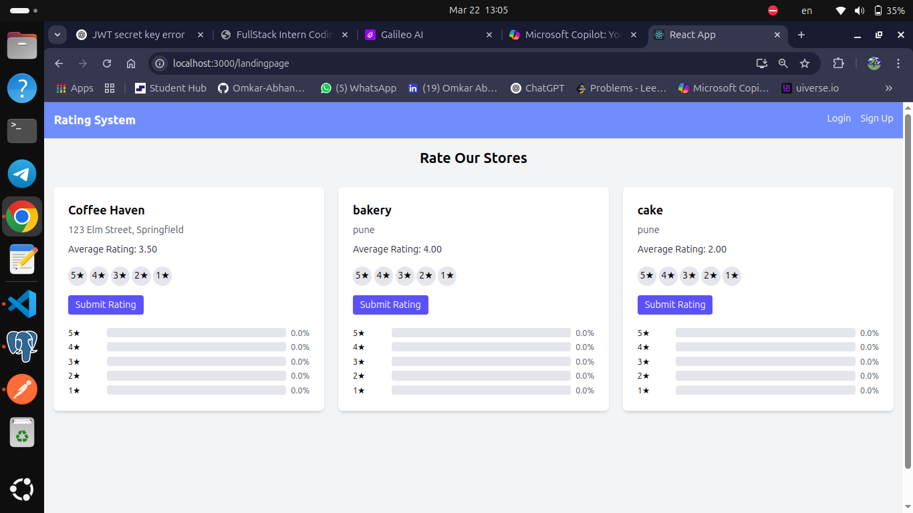
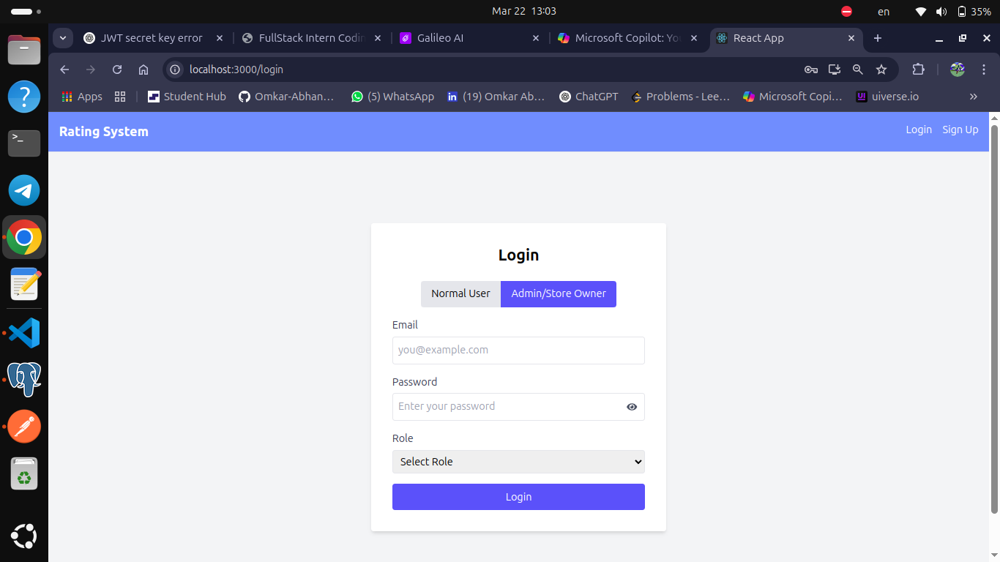
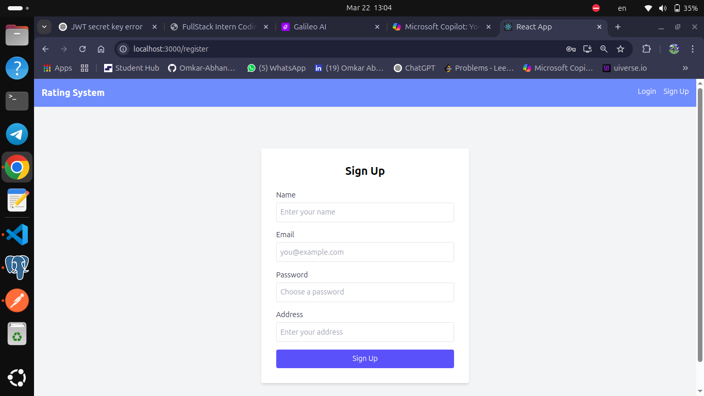
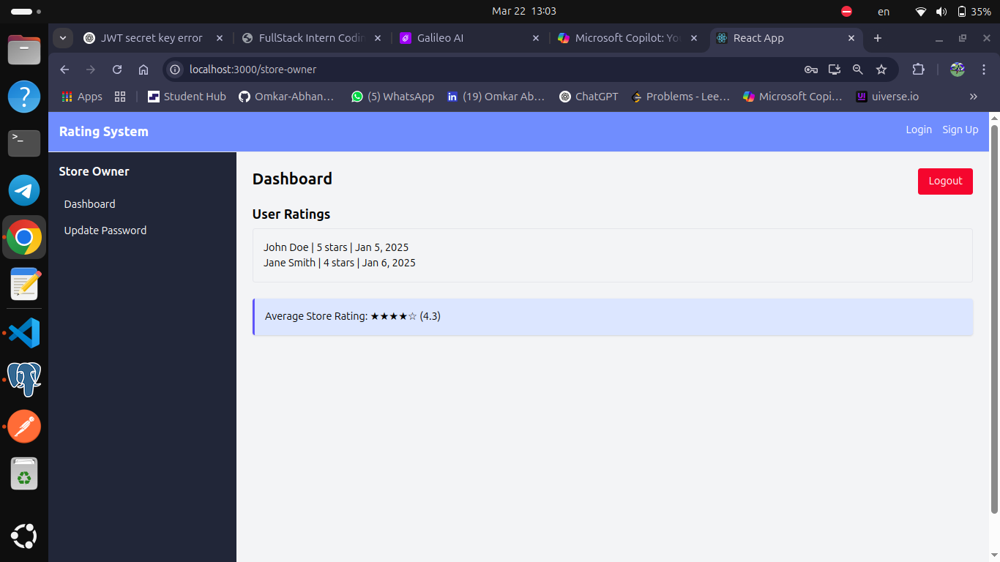
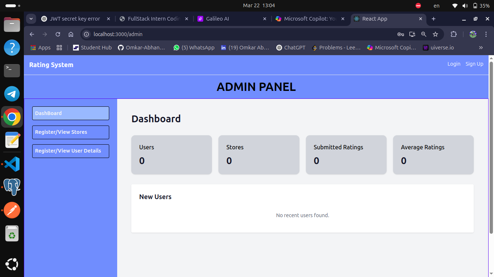

# **Roxiler Rating Web App** ⭐  

### **A full-stack rating system for stores, allowing users to submit and track ratings.**  

🚀 **Tech Stack:**  
- **Frontend:** React.js, Tailwind CSS  
- **Backend:** Node.js, Express.js, PostgreSQL  
- **Authentication:** JWT-based authentication  
- **Database:** PostgreSQL  

---

## **📸 Screenshots**  

### **🖥️ Home Page (Landing Page)**


### **🔐 Login Page**


### **🔐 Register Page**


### **⭐ Store owner panal **


### **⭐ Admin panal **


---

## **📌 Features**  
✅ **User Authentication** (JWT-based Login & Registration)  
✅ **Store Listing & Details**  
✅ **Submit & Update Ratings**  
✅ **Admin Panel for Store Management**  
✅ **Responsive UI with Tailwind CSS**  

---


## **🚀 Installation Guide**  

### **1️⃣ Clone the Repository**
```sh
git clone https://github.com/your-username/roxiler-rating-web-app.git
cd roxiler-rating-web-app
```

### **2️⃣ Backend Setup**  
📌 **Navigate to the `backend` folder and install dependencies:**  
```sh
cd backend
npm install
```

📌 **Create a `.env` file in the `backend` directory:**  
```env
PORT=5000
DB_HOST=localhost
DB_USER=your_db_username
DB_PASSWORD=your_db_password
DB_NAME=your_database_name
DB_PORT=5432
JWT_SECRET=your_secret_key_here
CORS_ORIGIN=http://localhost:3000
```

📌 **Start the Backend Server:**  
```sh
node server.js
```
or with Nodemon:
```sh
npx nodemon server.js
```

### **3️⃣ Frontend Setup**  
📌 **Navigate to the `frontend` folder and install dependencies:**  
```sh
cd ../frontend
npm install
```

📌 **Create a `.env` file in the `frontend` directory:**  
```env
REACT_APP_API_URL=http://localhost:5000
```

📌 **Start the Frontend Development Server:**  
```sh
npm start
```

---

## **🎯 API Endpoints**  

### **Authentication**
| Method | Endpoint       | Description              |
|--------|--------------|--------------------------|
| POST   | `/auth/login` | User login               |
| POST   | `/auth/register` | User registration       |
| GET    | `/auth/me`    | Get logged-in user data  |

### **Stores**
| Method | Endpoint         | Description                  |
|--------|----------------|------------------------------|
| GET    | `/stores/`      | Get all stores               |
| POST   | `/stores/`      | Add a new store (Admin only) |
| DELETE | `/stores/:id`   | Delete a store (Admin only) |

### **Ratings**
| Method | Endpoint        | Description                      |
|--------|----------------|----------------------------------|
| POST   | `/ratings`      | Submit or update user rating    |
| GET    | `/ratings/:id`  | Get all ratings for a store     |

---

## **🛠️ Technologies Used**
- **Frontend:** React.js, Tailwind CSS  
- **Backend:** Node.js, Express.js  
- **Database:** PostgreSQL  
- **Authentication:** JWT (JSON Web Token)  


🚀 **Enjoy building and improving the Roxiler Rating Web App!** 🚀  
